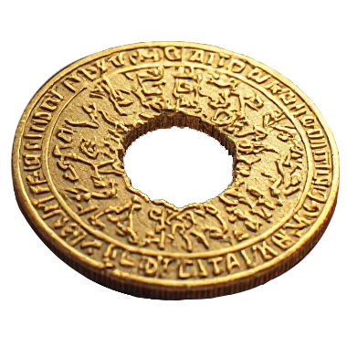
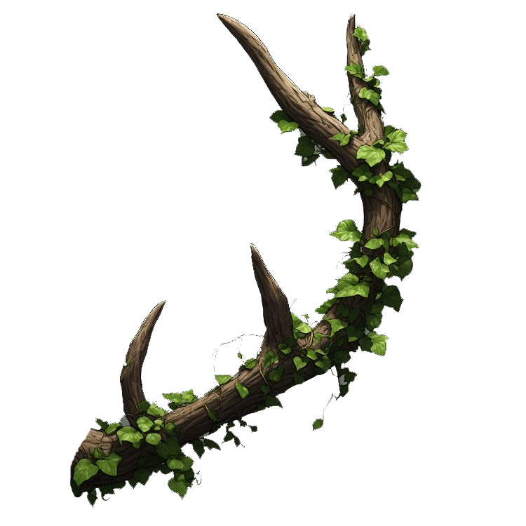
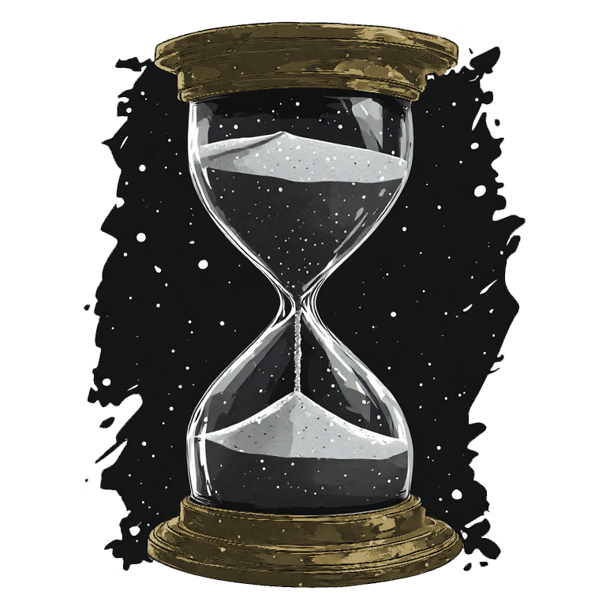

#dnd

| Deity                | Domain                                   | Symbol                                          |
| -------------------- | ---------------------------------------- | ----------------------------------------------- |
| [Kestos](Kestos.md)   | *Ο πατέρας των Θεών.*                    |   |
| [Bastion](Bastion.md) | *Θεός της προστασίας*                    |  |
| [Maia](Maia.md)       | *Η μητέρα των Θεών*                      |     |
| [Selene](Selene.md)   | *Η κυρά της νύχτας*                      |   |
| [Ruse](Ruse.md)       | *Ο Θεός της πανουργίας*                  |     |
| [Valia](Valia.md)     | *Θεά της φύσης*                          |    |
| [Mortis](Mortis.md)   | *Ο μελαγχολικός φύλακας του κάτω κόσμου* |   |
