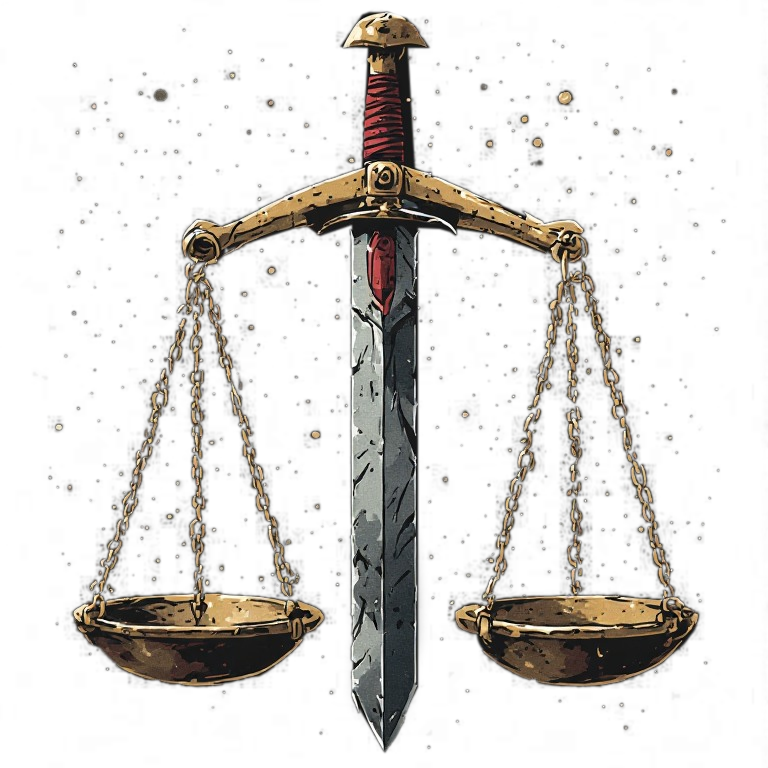

#Deity

domain:: *Ο πατέρας των Θεών.*

- Αυστηρός, 
- αμίληκτος, 
- εκπρόσωπος του νόμου και της **δικαιοσύνης**.
## Σύμβολο
symbol:: 100

ζυγός ισορροπίας, της οποίας το κεντρικό κομμάτι είναι ένα σπαθί

## Διασυνδέσεις

## Γεγονότα & Συμβάντα

