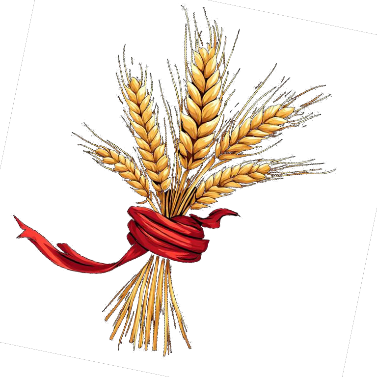

#Deity 

domain:: *Η μητέρα των Θεών*

- Θεά της γονιμότητας,
- συμβολίζει την σοδιά,
- την γέννηση,
- την ζωή
## Σύμβολο
symbol:: 100

Ένα ώριμο στάχυ δεμένο με μια κόκκινη κορδέλα

## Διασυνδέσεις

## Γεγονότα & Συμβάντα