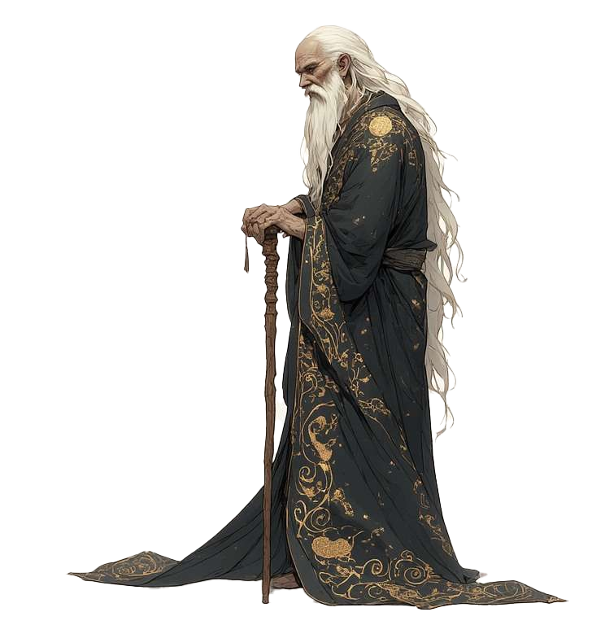

#dnd #player

| Player   | Race  | Class | Level | Background        |
| -------- | ----- | ----- | ----- | ----------------- |
| Nestoras | Human | Druid | 1     | Acolyte of Selene |

> A wise advisor, with a deep connection to [Selene](Selene.md) and the Arcane in general.

| Alignment | Age | Pronouns | Appearance |
| --------- | --- | -------- | ---------- |
| Neutral   | 69  | He/Him   | \-         |

## Quick Reference

|  AC | Initiative | Speed | Passive Perception | Proficiency Bonus |
| --: | ---------: | ----: | -----------------: | ----------------: |
|     |            |    30 |                    |                +2 |

## Ability Scores

### Abilities

|       | STR | DEX | CON | INT | WIS | CHA |
| ----- | --- | --- | --- | --- | --- | --- |
| Score |     |     |     |     |     |     |
| Bonus |     |     |     |     |     |     |

### Saving Throws

<table>
  <tr>
    <td colspan="2">STR</td>
    <td colspan="2">DEX</td>
    <td colspan="2">CON</td>
    <td colspan="2">INT</td>
    <td colspan="2">WIS</td>
    <td colspan="2">CHA</td>
  </tr>
  <tr>
    <td>+1</td>
    <td>[]</td>
    <td>+1</td>
    <td>[]</td>
    <td>+1</td>
    <td>[]</td>
    <td>+1</td>
    <td>[]</td>
    <td>+1</td>
    <td>[]</td>
    <td>+1</td>
    <td>[]</td>
  </tr>
</table>

### Skills
<table>
  <tr>
    <td>Ability</td>
    <td>Skill</td>
    <td colspan="2">Bonus</td>
  </tr>
  <!-- STR -->
  <tr>
    <td rowspan="1">STR</td>
    <td>Athletics</td>
    <td>+4</td>
    <td>X</td>
  </tr>
  <tr>
    <td colspan="4"></td>
  </tr>
  <!-- DEX -->
  <tr>
    <td rowspan="3">DEX</td>
    <td>Acrobatics</td>
    <td>+4</td>
    <td></td>
  </tr>
  <tr>
    <td>Sleight of Hand</td>
    <td>+4</td>
    <td></td>
  </tr>
  <tr>
    <td>Stealth</td>
    <td>+7</td>
    <td>X</td>
  </tr>
  <tr>
    <td colspan="4"></td>
  </tr>
  <!-- INT -->
  <tr>
    <td rowspan="5">INT</td>
    <td>Arcana</td>
    <td>+1</td>
    <td></td>
  </tr>
  <tr>
    <td>History</td>
    <td>+4</td>
    <td>X</td>
  </tr>
  <tr>
    <td>Investigation</td>
    <td>+4</td>
    <td>X</td>
  </tr>
  <tr>
    <td>Nature</td>
    <td>+4</td>
    <td>X</td>
  </tr>
  <tr>
    <td>Religion</td>
    <td>+1</td>
    <td></td>
  </tr>
  <tr>
    <td colspan="4"></td>
  </tr>
  <!-- WIS -->
  <tr>
    <td rowspan="5">WIS</td>
    <td>Animal Handling</td>
    <td>+6</td>
    <td>X</td>
  </tr>
  <tr>
    <td>Insight</td>
    <td>+6</td>
    <td>X</td>
  </tr>
  <tr>
    <td>Medicine</td>
    <td>+3</td>
    <td></td>
  </tr>
  <tr>
    <td>Perception</td>
    <td>+9</td>
    <td>XX</td>
  </tr>
  <tr>
    <td>Survival</td>
    <td>+9</td>
    <td>XX</td>
  </tr>
  <tr>
    <td colspan="4"></td>
  </tr>
  <!-- CHA -->
  <tr>
    <td rowspan="4">CHA</td>
    <td>Deception</td>
    <td>+0</td>
    <td></td>
  </tr>
  <tr>
    <td>Intimidation</td>
    <td>+0</td>
    <td></td>
  </tr>
  <tr>
    <td>Performance</td>
    <td>+0</td>
    <td></td>
  </tr>
  <tr>
    <td>Persuasion</td>
    <td>+3</td>
    <td>X</td>
  </tr>
</table>

### Spellcasting Summary

| Ability | Spell Save DC | Spell Attack |
| ------- | ------------: | -----------: |
| WIS     |            14 |           +4 |

## Inventory

| CP  | SP  | EP  | GP  | PP  |
| :-: | :-: | :-: | :-: | :-: |
|     |     |  -  |     |     |
## Backstory
???
## Connections

| Allies | Organisations | Locations |
| ------ | ------------- | --------- |
| \-     | \-            | \-        |

## Notes